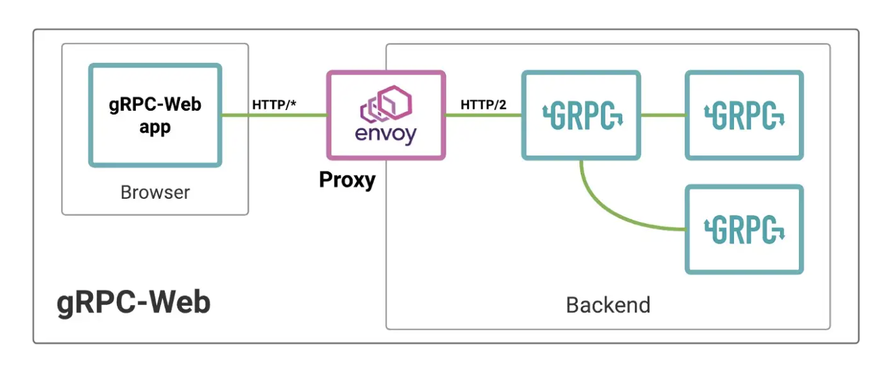

# CS1680 - Snowcast with GRPC and React
**Members:** Jenny Yu and Tianren Dong

## Project Introduction
The goal of the project is to understand what gRPC is, how it works with web clients, and implement a small application using gRPC and React. Our initial plan was to use this tech stack to implement Snowcast, but the plan changed as we discovered the various limitations related to streaming (see section on Challenges). Eventually, we implemented a chat app with server-side streaming, where users can send each other text messages and music that is available on the server. Music can be played out in browsers. 

The README contains detailed information about building and running the application.

## Demo

https://user-images.githubusercontent.com/52697551/206933836-33d26b4b-6c89-4640-b3eb-daecc10facce.mp4

## gRPC & gRPC for web client
gRPC is a framework for Remote Procedure Call (RPC). Based on our understanding and usage so far, it has two primary advantages: 
1. gRPC allows users to define message formats and services using Protocol Buffers and automatically generates client and server service stubs in different languages. Developers need to strictly adhere to the message formats for service requests and responses, and can access different fields of the message using the accessor and mutator methods generated. Compared to self-implemented protocols, like what we have done in Snowcast, this reduces the need to write customized marshall and unmarshall functions for different messages. In addition, this ensures that the message and service definitions are consistent across the client and server, making the program robust and extensible. 

2. For client-server communication, gRPC has much better performance compared to REST APIs. REST APIs follow a request-response model of communication that is typically built on HTTP/1.1. If a server receives multiple requests from multiple clients, the model has to handle each request at a time which slows down the system. On the other hand, gRPC is built on HTTP/2 and follows a client-server communication, but it reduces development complexity by hiding HTTP from the developers. With the ability to handle requests from different clients simultaneously, it supports 3 types of streaming communication: server-side streaming, where the client sends a request and gets a stream to read a sequence of messages back; client-side streaming, where the client sends a sequence of messages over a stream and gets a response back; and bidirectional streaming. 

However, for gRPC to work with web clients, an Envoy proxy needs to be set up. Based on our understanding, web clients produce HTTP/1.1 requests, yet gRPC uses HTTP/2 for transport, hence a proxy is needed to translate the browser request to HTTP/2 requests that can be handled by gRPC services. Although HTTP is still the underlying protocol used, Envoy has built-in support for gRPC-Web and takes care of the translation. As developers, we only define some configurations inside the `./client/envoy.yaml` file.

## Challenges
### Streaming mp3
We successfully implemented streaming chunks of music data from the server to client using gRPC’s server-side streaming, but the client could not decode the music data and play the sound as it receives from the server. This is because the mp3 format uses padding bytes, hence a song has to be fully transmitted in order to be decoded and played out. Since this is an inherent limitation of the mp3 music format, we decided to experiment with sending and receiving entire songs between different clients, using the server as a broadcast mechanism–i.e. a chat app with the ability to transfer files. 
### No client-side streaming for browser-based gRPC
Using server-side streaming, we implemented a simple chat app where clients can broadcast text messages to all other clients (when a client connects, the server opens a stream to transmit messages whenever it receives messages from any client).  However, when we try to send over music data in chunks, the data could be decoded properly although all of the bytes were sent and received (the music would only play for a few seconds). 

After research, we discovered that this is because the client was sending over chunks of music data in independent RPC calls. gRPC guarantees message sequencing within an independent RPC call, which includes messages sent over a stream, but does not make the guarantee between calls because of its ability to process requests simultaneously. However, gRPC web currently only supports server-side streaming, but not client-side and bidirectional streaming (see [streaming roadmap](https://github.com/grpc/grpc-web/blob/master/doc/streaming-roadmap.md)). Therefore it seems unfeasible to implement uploading files from the client, unless we attach an index to each message and rearrange them on the server.

## Final Design & Implementation
After recognizing the limitations and revising our designs, we eventually implemented a [chat app]() where clients can broadcast text messages and music that is available on the server. Clients will also get notified when other clients connect to the server.

We defined 5 services:

      service Snowcast {
            rpc Connect (User) returns (stream MessageUpdate) {}
            rpc GetPlaylist (google.protobuf.Empty) returns (Playlist) {}
            rpc SendMessage (Message) returns (google.protobuf.Empty) {}
            rpc FetchMessages (FetchRequest) returns (Messages) {}
            rpc FetchMusic (Music) returns (stream FileChunk) {}
      } 

On a high level, the program works in the following way:
- The server maintains a map of client connections and a list of all messages sent. Mutexes are used to prevent concurrent access to both structures (e.g. two clients connecting simultaneously, clients connecting and breaking out simultaneously, etc.). The server also maintains an index for the latest message sent. 
- When a client first connects, it does 2 things: sends a `Connect` request to the server, who opens a stream for sending `MessageUpdate` and adds the client to the list of connections; sends a `GetPlaylist` request to the server, which returns a list of music names available. 
- When a client sends a message (either text or music), the server adds the message to the messages list, updates the latest index, and sends a `MessageUpdate` with the updated index to all clients currently connected.
- When a client receives the `MessageUpdate`, it sends a `FetchMessages` request telling the server the next message it needs, and the server sends all available messages that has not been sent to this client.
- The client only makes a `FetchMusic` request when the play button is clicked. The server sends back the music data in chunks over a stream.

### Design Decisions

Our main design decision was to have the server open a stream for sending  `MessageUpdate`, instead of directly broadcasting messages via the stream. We referenced the notification system for apps such as iMessage and Wechat, where sometimes we would receive notifications for incoming messages, but once we open the app, it takes a few seconds for the messages to load. We see two major benefits with this design:

1. Whenever clients reconnect, they can see all the previous messages that were sent (as long as they are stored on the server). In a group chat setting, clients who connect at a later time can also see the previous conversations.

2. If the server directly opens a stream for sending messages to client (what we did in our initial implementation), it is difficult to maintain a consistent order of messages between different clients, since multiple clients can send messages at the same time, but the messages might reach their peers in different orders. It's possible to add timestamps to the messages and rearrange the packets in the frontend, but we decided that this would be inefficient since frontend processing is slow. In addition, we were also sending music chunks in the same stream. Since streaming music takes a while, another client can send a text message in between, which will be mixed up in the music chunks.  

## Conclusions/Future work

1. Features

Some new features that we thought of implementing include 
- Graceful exits with notifications to other clients
- A more robust login system such that users will be able to reconnect to their same account
- Ability to send messages to individuals instead of broadcasting
- Progress bar for fetching music
- Some non-system related, user experience improvements: prettier frontend, ability to pause and resume music, etc. :>

The way our current services are set up and gRPC's protocol buffers make extending these features relatively easy. For example, to support sending message to individuals, we would add a receiver field in our Message struct. For implementing a progress bar when fetching music, we would include a total length field and a current index field inside the music chunks that are sent. Graceful exit would require an additional service definition that requests the server to delete the client connection. 

2. Infrastructure

We discovered that it is possible to use gRPC-web without Envoy proxy ([reference](https://programmingpercy.tech/blog/using-grpc-tls-go-react-no-reverse-proxy/)). The idea is to create a wrapper for a HTTP server that can be used to handle gRPC requests. Although Envoy is listed on the gRPC documentation as the recommended proxy with web client support, this would be an interesting experiment.

## References
[Grpc](https://grpc.io/docs/languages/go/quickstart/)

[Grpc & React Example](https://daily.dev/blog/build-a-chat-app-using-grpc-and-reactjs)

[Protobuf](https://developers.google.com/protocol-buffers/docs/overview)

[Envoy & gRPC Web](https://blog.envoyproxy.io/envoy-and-grpc-web-a-fresh-new-alternative-to-rest-6504ce7eb880)

[Protoc plugin for generating service stubs in Typescript](https://www.npmjs.com/package/ts-protoc-gen)
